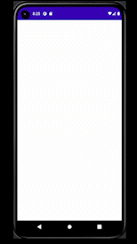
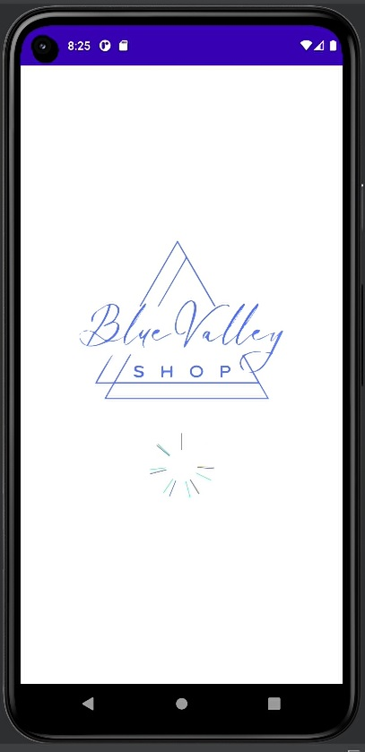
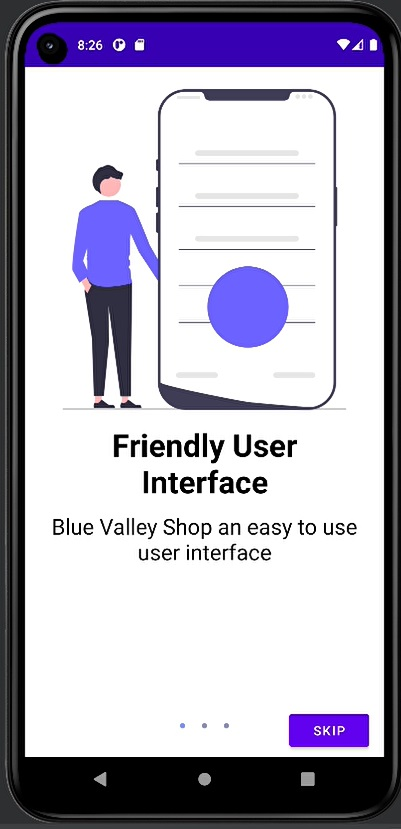
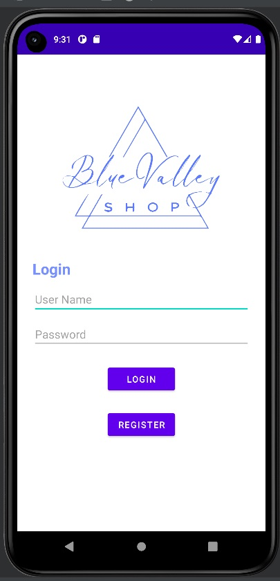
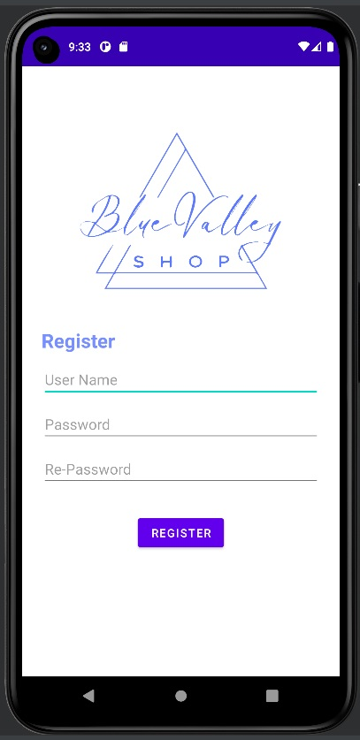
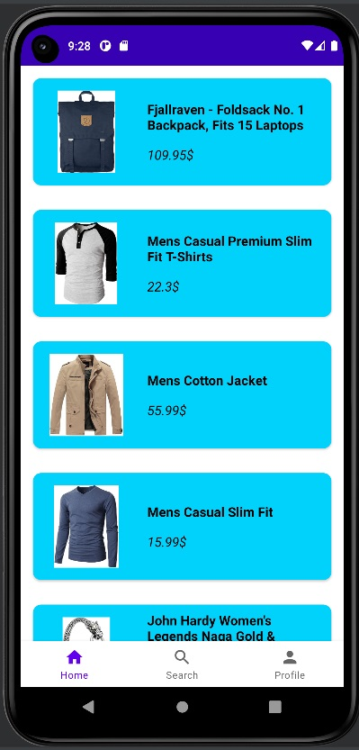

# Blue Valley Shop

*This app was developed by myself as a graduation project for the Pazarama Kotlin Bootcamp.*

## Used Technologies

- *MVVM*
- *Hilt*
- *Android Flow*
- *Coroutines*
- *Firebase*
- *Retrofit*
- *Data Store Manager*
- *Navigation Component*

## Demo

## Screens

